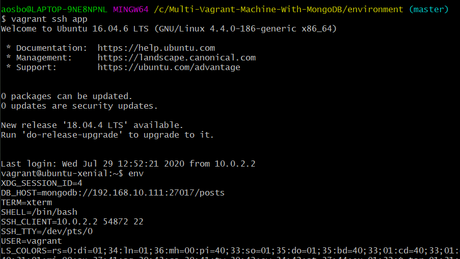

# Setting Up MongoDB In Our Vagrant Environments


In order to set up mongoDB we must have mongo.config as well as mongo.

must create a variable to make data persistent in a database

There are two types of variables
- Environment variables ---> Use these inside an environment, for example a virtual machine
- Normal variables


Each VM is an environment, we create variables within our app VM

How to create ENV variable in linux

```bash
name = "eng-67"
```

Displaying the value of the variable
``` echo $name```


store the command value in your variable and then display it
``` dir=$(pwd)```

``` echo $dir```

This is how organisations are able to create shortcuts that we use day to day

``` export name="eng-67"```

``` env ``` is a command that lists to us all the available environment variables


## Steps to Creating an Environment variable and using it from a Bash Script

### 1) Within the VM, make your way to the /app directory and create a bash script
```bash
touch env_var.sh
```

### 2) We then entered the file and inputted the following code
```bash
name="Andrew"
echo $name

dir=$(ls)
echo $dir
```

### 3) Allowing Permission to the script file
```bash
chmod +x env_var.sh
```
Now when we run the script in the terminal we should see both our name
as well as the current components of the folder


### Steps to creating a variable connection to MongoDB
root@ubuntu-xenial:/home# export DB_HOST="mongodb://192.168.10.111:27017/posts"

27017 is the default code for connecting to mongoDB

 
 
## Permanently storing Variables 

### 1) Locate the .profile file

- After doing the sudo su command to become root user, locate to the /vagrant folder within the
VM, then type ls and this should show us the .profile file

```bash
nano .profile
```
This will allow us to enter the profile file.

### 2) Adding the export command to the file to make it persistent
 
- Once inside the profile file, scroll to the bottom and add the following command
```bash
EXPORT DB_HOST="mongodb://192.168.10.111:27017/posts"
```

### 3) Making sure the variables have persisted

- After having done these steps, we can save the file and exit the Virtual Machine
- We then run ``` vagrant ssh app``` and type ``` env ```

If we are able to see the variable that we have created, our variable has persisted!




```vagrant@ubuntu-xenial:~$ ```
the ~$ means were are in the root directory, it does not mean we are the root user


``` root@ubuntu-xenial: ```
The root before the path here tells us we are the root user


Note that we are drivers of the product, understanding what is going on under the bonnet and how to write JS is for the
front end team.

As DevOps engineers all we need to know is how to integrate these different parts together to integrate and get the 
product live.